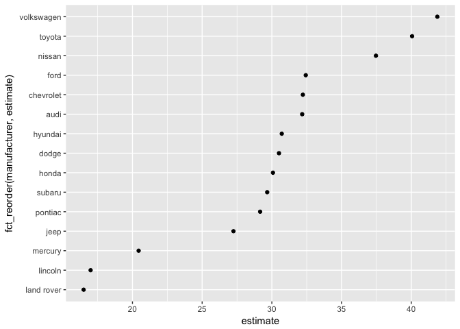

``` r
library(tidyverse)
```

    ## ── Attaching packages ─────────────────────────────────── tidyverse 1.2.1 ──

    ## ✔ ggplot2 2.2.1     ✔ purrr   0.2.4
    ## ✔ tibble  1.4.2     ✔ dplyr   0.7.4
    ## ✔ tidyr   0.8.0     ✔ stringr 1.2.0
    ## ✔ readr   1.1.1     ✔ forcats 0.2.0

    ## Warning: package 'tibble' was built under R version 3.4.3

    ## Warning: package 'tidyr' was built under R version 3.4.3

    ## ── Conflicts ────────────────────────────────────── tidyverse_conflicts() ──
    ## ✖ dplyr::filter() masks stats::filter()
    ## ✖ dplyr::lag()    masks stats::lag()

``` r
library(broom)

mpg
```

    ## # A tibble: 234 x 11
    ##    manufacturer model    displ  year   cyl trans   drv     cty   hwy fl   
    ##    <chr>        <chr>    <dbl> <int> <int> <chr>   <chr> <int> <int> <chr>
    ##  1 audi         a4        1.80  1999     4 auto(l… f        18    29 p    
    ##  2 audi         a4        1.80  1999     4 manual… f        21    29 p    
    ##  3 audi         a4        2.00  2008     4 manual… f        20    31 p    
    ##  4 audi         a4        2.00  2008     4 auto(a… f        21    30 p    
    ##  5 audi         a4        2.80  1999     6 auto(l… f        16    26 p    
    ##  6 audi         a4        2.80  1999     6 manual… f        18    26 p    
    ##  7 audi         a4        3.10  2008     6 auto(a… f        18    27 p    
    ##  8 audi         a4 quat…  1.80  1999     4 manual… 4        18    26 p    
    ##  9 audi         a4 quat…  1.80  1999     4 auto(l… 4        16    25 p    
    ## 10 audi         a4 quat…  2.00  2008     4 manual… 4        20    28 p    
    ## # ... with 224 more rows, and 1 more variable: class <chr>

``` r
lm(hwy ~ displ, data = mpg)
```

    ## 
    ## Call:
    ## lm(formula = hwy ~ displ, data = mpg)
    ## 
    ## Coefficients:
    ## (Intercept)        displ  
    ##      35.698       -3.531

``` r
lm_mod <- function(df){
  lm(hwy ~ displ, data = df)
}

lm_mod(mpg)
```

    ## 
    ## Call:
    ## lm(formula = hwy ~ displ, data = df)
    ## 
    ## Coefficients:
    ## (Intercept)        displ  
    ##      35.698       -3.531

``` r
mpg_manf <- mpg %>% 
  group_by(manufacturer) %>% 
  nest()

mpg_manf$data[[3]]
```

    ## # A tibble: 37 x 10
    ##    model       displ  year   cyl trans    drv     cty   hwy fl    class  
    ##    <chr>       <dbl> <int> <int> <chr>    <chr> <int> <int> <chr> <chr>  
    ##  1 caravan 2wd  2.40  1999     4 auto(l3) f        18    24 r     minivan
    ##  2 caravan 2wd  3.00  1999     6 auto(l4) f        17    24 r     minivan
    ##  3 caravan 2wd  3.30  1999     6 auto(l4) f        16    22 r     minivan
    ##  4 caravan 2wd  3.30  1999     6 auto(l4) f        16    22 r     minivan
    ##  5 caravan 2wd  3.30  2008     6 auto(l4) f        17    24 r     minivan
    ##  6 caravan 2wd  3.30  2008     6 auto(l4) f        17    24 r     minivan
    ##  7 caravan 2wd  3.30  2008     6 auto(l4) f        11    17 e     minivan
    ##  8 caravan 2wd  3.80  1999     6 auto(l4) f        15    22 r     minivan
    ##  9 caravan 2wd  3.80  1999     6 auto(l4) f        15    21 r     minivan
    ## 10 caravan 2wd  3.80  2008     6 auto(l6) f        16    23 r     minivan
    ## # ... with 27 more rows

``` r
mpg_manf <- mpg_manf %>% 
  mutate(model = map(data, lm_mod))

mpg_manf$model[[1]]
```

    ## 
    ## Call:
    ## lm(formula = hwy ~ displ, data = df)
    ## 
    ## Coefficients:
    ## (Intercept)        displ  
    ##      32.176       -2.253

``` r
mpg_manf <- mpg_manf %>% 
  mutate(fit = map(model, tidy))

mpg_manf$fit[[1]]
```

    ##          term  estimate std.error statistic      p.value
    ## 1 (Intercept) 32.176233 1.5215695 21.146739 4.043896e-13
    ## 2       displ -2.252668 0.5791584 -3.889554 1.302115e-03

``` r
mpg_manf <- mpg_manf %>% 
  unnest(fit)
```

``` r
mpg_manf %>%
  filter(term == "(Intercept)") %>% 
  ggplot(aes(x = fct_reorder(manufacturer, estimate), y = estimate)) +
  geom_point() +
  coord_flip()
```



``` r
mpg %>%
  group_by(manufacturer) %>% 
  nest() %>% 
  mutate(model = map(data, ~lm(hwy ~ displ, data = .x)),
         fit = map(model, tidy)) %>% 
  unnest(fit)
```

    ## # A tibble: 29 x 6
    ##    manufacturer term        estimate std.error statistic           p.value
    ##    <chr>        <chr>          <dbl>     <dbl>     <dbl>             <dbl>
    ##  1 audi         (Intercept)    32.2      1.52     21.1            4.04e⁻¹³
    ##  2 audi         displ         - 2.25     0.579   - 3.89           1.30e⁻ ³
    ##  3 chevrolet    (Intercept)    32.2      3.96      8.13           2.91e⁻ ⁷
    ##  4 chevrolet    displ         - 2.04     0.757   - 2.70           1.53e⁻ ²
    ##  5 dodge        (Intercept)    30.5      2.23     13.7            1.25e⁻¹⁵
    ##  6 dodge        displ         - 2.87     0.499   - 5.75           1.65e⁻ ⁶
    ##  7 ford         (Intercept)    32.4      5.18      6.26           2.16e⁻ ⁶
    ##  8 ford         displ         - 2.88     1.13    - 2.54           1.82e⁻ ²
    ##  9 honda        (Intercept)    30.1     11.4       2.65           3.32e⁻ ²
    ## 10 honda        displ           1.45     6.62      0.219          8.33e⁻ ¹
    ## # ... with 19 more rows
